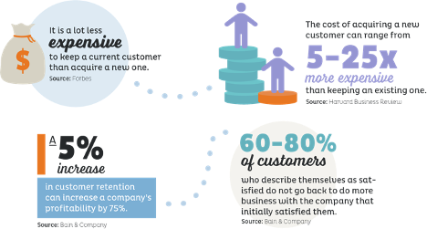
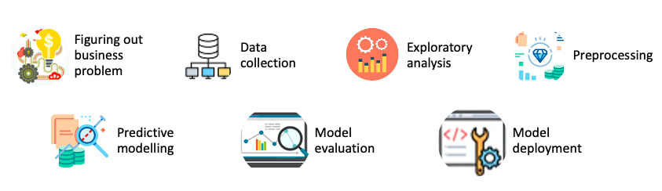

# **Understanding Customer Churn – Prediction and prevention**
Customer churn, also known as customer attrition, refers to when a customer cancels his or her subscription or ceases his or her relationship with a company. 
Every company defines churn differently. For instance, an online retail company may consider a customer churned when the customer hasn’t bought something in say three months. A telecom company may define it when a customer explicitly cancels their subscription or doesn’t renew one. However may the companies choose to define it, it remains a critical metric for revenue generation, growth and profits. After all, each lost customer is loss in revenue lost and increase in marketing costs. According to Forbes, it can cost five times more to attract a new customer, than it does to retain an existing one. 
Moreover, research shows that loyal customers tend to spend more than new customers. Thus, it will always do well to retain customers and avoid churn. In fact, a happy, satisfied and loyal customer can help with word-of-mouth marketing and steer new customers.

 

[Image Source](https://www.ocreativedesign.com/customer-retention-using-marketing-automation/)

As I’m quite interested in ecommerce, I wanted to work with a churn dataset to develop a machine learning algorithm to predict churn.

## **Project workflow**
For the project I tried to follow a typical data science project workflow. 

 

## **The dataset**
After identifying the business problem of customer churn that I wanted to help solve, I looked for a dataset. I have used a publicly available dataset from [Kaggle](https://www.kaggle.com/blastchar/telco-customer-churn).

This is a relatively clean however imbalanced dataset, and provides ample opportunity to explore the data, make some meaningful visualizations, derive insights and build machine learning algorithms to make predictions.

Here's a brief data dictionary:
* Customers who left within the last month – this column is called Churn
* Services that each customer has signed up for – phone, multiple lines, internet, online security, online backup, device protection, tech support, and streaming TV and movies
* Customer account information – how long they’ve been a customer, contract, payment method, paperless billing, monthly charges, and total charges
* Demographic information about customers – gender, age range, and if they have partners and dependents

## **Exploratory analysis and insights**
* Customers with basic services are more likely to churn, thus it might do good to offer some services like tech support or online protection either free or may be at a promotional rate. This might help to improve the customer experience and loyalty, and thus reduce chances of churn.
* Also, customers with no dependents or partners have more chances of leaving, thus, promotional deals for this segment who have opted for basic facilities could be focussed upon.
* Also, the shorter the contract, the more the chances of churn. Thus, deals with longer contract should be made more enticing for the customers.
* Further, customers with fibre-optic internet services, paperless billing options and electronic check payment method are more possible to leave.

## **Data preprocessing**
* Fixing null values- The total charges column had some nulls which were coded as spaces in the original dataset. I have filled in the missing values with median for the column with specific tenure and contract.

* Barring three columns, the rest were all categorical. In order to build machine learning algorithms, I had to convert them into numerical columns. I have converted the binary ordinal columns into 0 and 1 values. The columns with three classes, for instance, Multiple Phone Lines, which had three options- Yes, No, No phoneline - I converted the 'No phoneline class' to 'No', and then converted the column values into 0 for No and 1 for Yes. This turned out to be as effective but less computationally expensive than one-hot-encoding. For the remaining columns with more than three values, I one-hot encoded them.

* During the initial data exploration, I realized that the dataset is imbalanced with far more customers who had not churned. Also, when I employed logistic regression to pick the transformation for the columns in the above section, the precision and recall values for the churned customers were quite low, which essentially means that the model is not able to predict churn well. To rectify this issue, I'll tried to balance the dataset. I tried oversampling, SMOTE (Synthetic Minority Over-sampling Technique) and ADASYN (Adaptive Synthetic Sampling Method). I tested these techniques with vanilla logistic regression to decide which approach to use, with the SMOTE providing best results.

## **Machine learning algoithms**

In order to predict churn, I tried Logistic regression, Decision tree, Random forest and XGBoost. Logistic regression did the best job with overall best accuracy as well as Precision and Recall.

